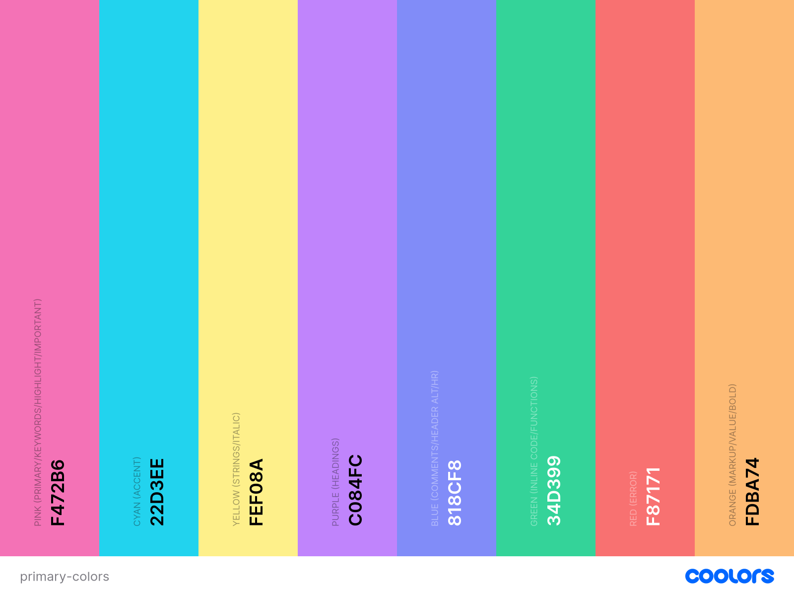
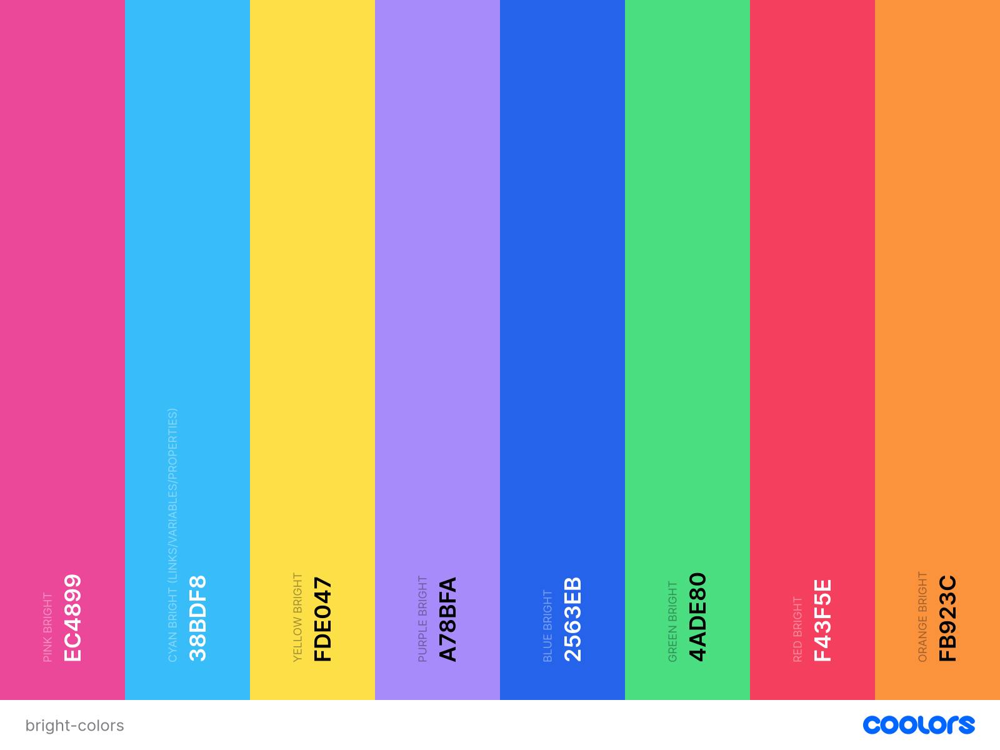
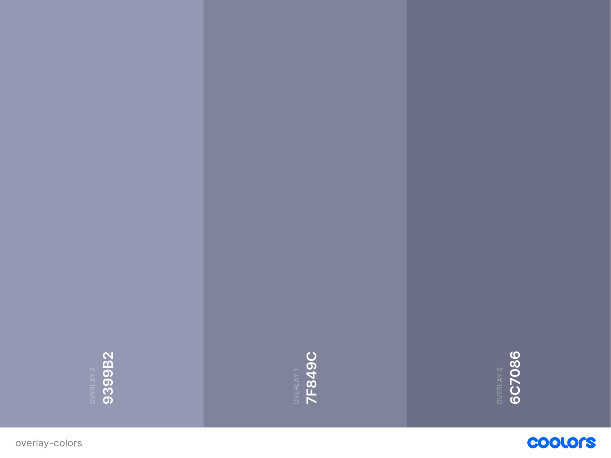

# Miami Wind Obsidian Theme
An Obsidian theme based on Miami Wind color scheme

# Color Palette

## Base Colors
[Primary Colors](https://coolors.co/f472b6-22d3ee-fef08a-c084fc-818cf8-34d399-f87171-fdba74)

## Additional Colors
[Bright Colors](https://coolors.co/palette/ec4899-38bdf8-fde047-a78bfa-2563eb-4ade80-f43f5e-fb923c)

## Greyscale

[Text Colors](https://coolors.co/cdd6f4-bac2de-a6adc8)

[Overlay Colors](https://coolors.co/9399b2-7f849c-6c7086)

[Surface Colors](https://coolors.co/585b70-45475a-313244)

[Background Colors](https://coolors.co/1e1e2e-181825-11111b)

