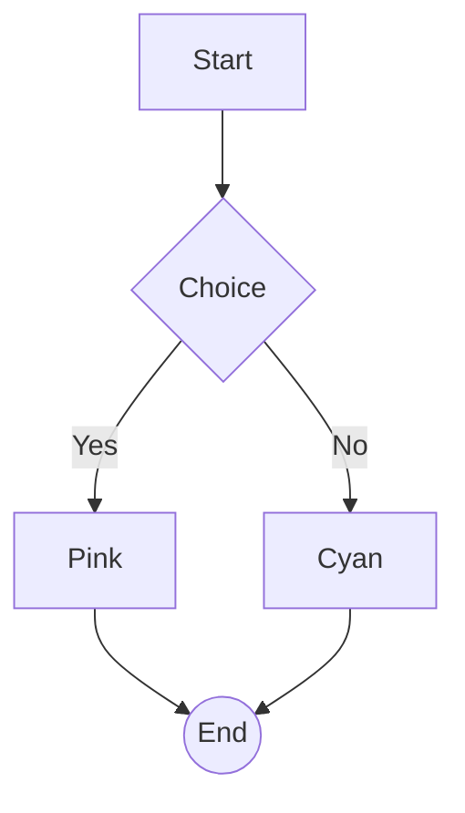
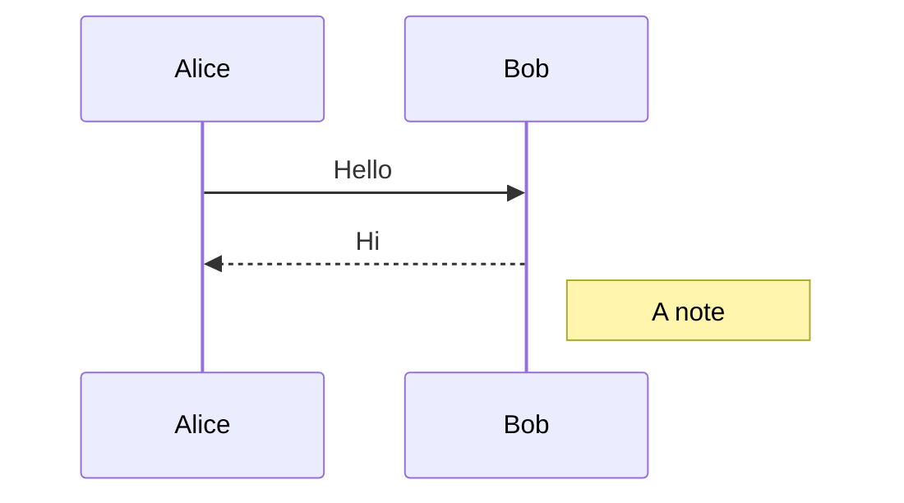
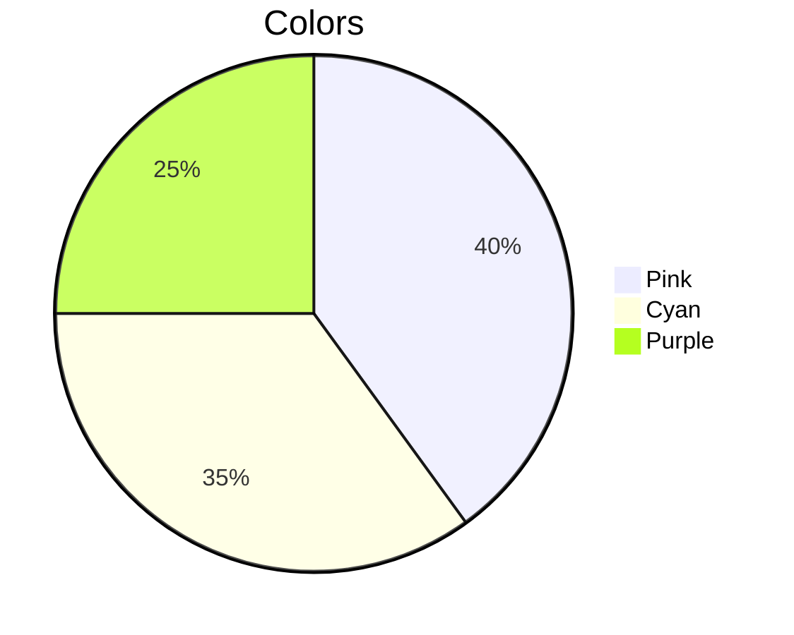
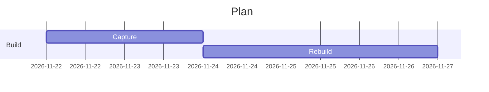
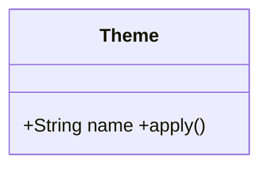
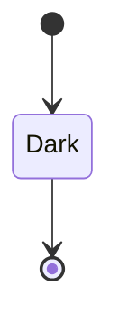
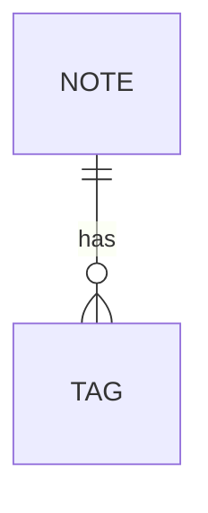

# Mermaid

```mermaid
graph TD
  A[Start] --> B{Choice}
  B -->|Yes| C[Pink]
  B -->|No| D[Cyan]
  C --> E((End))
  D --> E
```

```mermaid
sequenceDiagram
  Alice->>Bob: Hello
  Bob-->>Alice: Hi
  Note right of Bob: A note
```

```mermaid
pie title Colors
  "Pink": 40
  "Cyan": 35
  "Purple": 25
```

```mermaid
gantt
  title Plan
  section Build
  Capture :a1, 2026-11-22, 2d
  Rebuild :after a1, 3d
```

```mermaid
classDiagram
  class Theme { +String name +apply() }
```

```mermaid
stateDiagram-v2
  [*] --> Dark
  Dark --> [*]
```

```mermaid
erDiagram
  NOTE ||--o{ TAG : has
```

```mermaid
this is not valid mermaid
```
